## 综述

**本文参考分析整理总结了AMBA AXI and ACE Protocol Specification文档的AXI总线协议规范部分，错误之处欢迎指出。**

AMBA AXI协议支持高性能高频的系统设计，该协议拥有以下优点：

* 适合高带宽和低延迟的设计
* 不需要复杂的桥即可提供高频操作
* 可以满足多种组件的接口需求
* 适合高初始访问延迟的存储器控制器
* 提供互联架构实现的灵活性
* 向后兼容AHB与APB接口

同时，该协议还拥有以下特点：

* 分离的地址/控制和数据阶段
* 通过使用字节选通信号的方式支持非对齐数据传输
* 使用突发传输时只需要传输起始地址
* 允许地址信息提前于实际数据传输发送
* 分离的读写数据通道，这可以提供低损耗的DMA
* 支持发出多个未完成的地址
* 支持乱序传输完成
* 允许简单添加寄存器阶段以提供时序收敛

AXI协议同时包含了低功耗操作所需的信号扩展，也包含了AXI4-Lite协议，该协议是AXI4的子集，有着更简单的控制寄存器接口和组件。

## AXI通道简述

### 综述

AXI协议基于突发传输，定义了下列独立事务（一个事务可能包含多次传输）通道：

* 读地址
* 读数据
* 写地址
* 写数据
* 写响应

地址通道携带描述被传输数据性质的控制信息，数据在主设备和从设备间通过以下方式传输：

1. 写数据通道从主设备传输数据到从设备，在写传输时，从设备使用写响应通道通知主设备传输完成。
2. 读数据通道从从设备传输数据到主设备。

写数据的过程如下图所示：

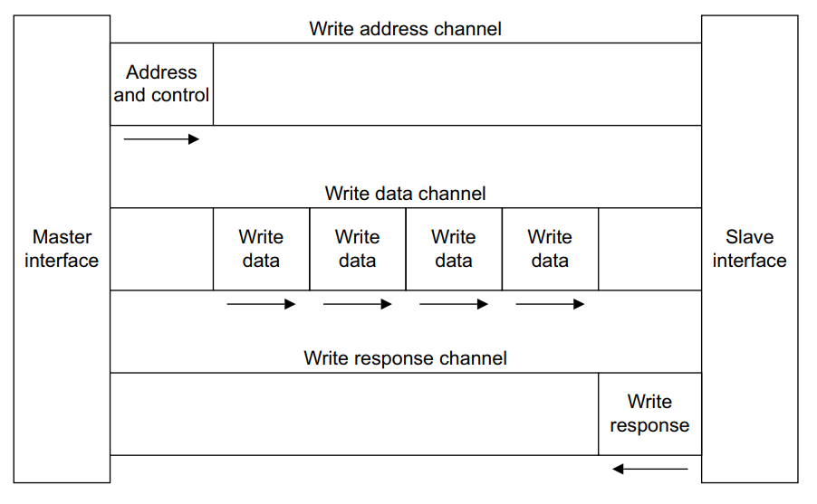

读数据的过程如下图所示：

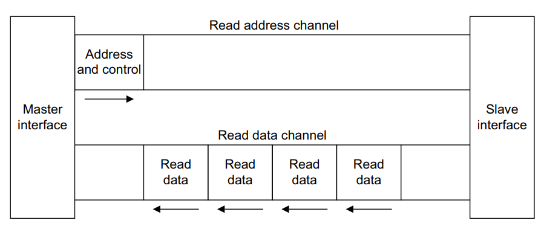

每一个通道都拥有自己的VALID与READY信号用于实现握手，其中VALID信号表示通道的地址、数据或控制信息已经可用，而READY信号则表示接收方已准备好接收信息，其中，读数据和写数据通道还拥有LAST信号，该信号用于指示当前传输是否为当前事务中的最后一次传输。

### 读地址与写地址通道

读事务与写事务都拥有其自己的地址通道，对应的地址通道会携带一次事务所需的全部地址和控制信息。

### 读数据通道

读数据通道携带从设备传送给主设备的数据和响应信息，该通道包括两部分：

1. 位宽可为8、16、32、64、128、256、512、1024bit的数据总线。
2. 表示读事务完成状态的读响应信号。

### 写数据通道

写数据通道携带主设备传送给从设备的数据，该通道包括两部分：

1. 位宽可为8、16、32、64、128、256、512、1024bit的数据总线。
2. 为每一个8bit数据准备的字节选通信号，用于指示数据的哪几个字节是有效的。

写数据通道总是被buffer的，因此主设备可以在未收到前一次写事务的从设备响应消息时再次执行写操作。

### 写响应通道

从设备使用写响应通道回应写事务，全部的写事务都需要写响应通道的完成信号，并且完成信号仅在一个写事务彻底完成时才产生，而并不会在每次数据传输时都产生。

## AXI互联结构

一个典型的AXI系统结构如下：

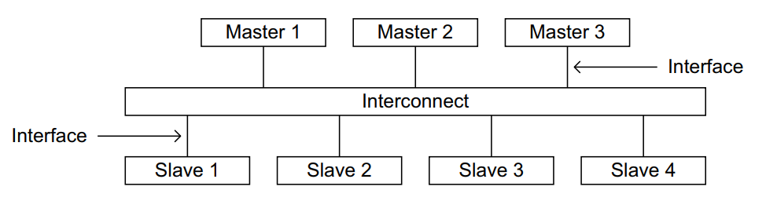

AXI协议为以下接口提供了单一的接口定义：

* 在主设备和互联器（Interconnect）之间
* 在从设备和互联器之间
* 在主设备和从设备之间

该接口定义支持不同的互联器实现，设备之间的互联器等效于另一个拥有对称主端口和从端口的设备，真正的主设备和从设备可以连接到对应的端口。

大多数的系统使用如下三种互联拓扑之一：

* 共享的地址和数据总线
* 共享的地址总线以及多条数据总线
* 多层，具有多个地址和数据总线

在大多数的系统中，地址通道带宽需求远小于数据通道带宽需求。使用共享总线以及多条数据总线的拓扑结构实现并行数据传输时，可以在系统效率和互联复杂性间取得平衡。

## AXI中使用寄存器切片

每一个AXI通道都只能单项传输信息，并且架构并没有要求各个通道间具有固定的时序依赖要求。因此，寄存器切片可以插入到任何通道的任何位置，不过这会带来额外的延迟（Latency）。

以下两点是可能的：

* 在延迟和最大操作频率之间取得平衡。
* 在处理器和高性能存储器之间实现直接而又快速的链接，但同时又使用寄存器切片隔离性能不敏感外设的长路径。

## AXI术语

### AXI组件与拓扑

下列术语描述了AXI组件：

* 组件（Component）
* 主组件（Master component）
* 从组件（Slave component），从组件包含存储器子组件和外设子组件
* 互联组件

对于特定的AXI传输，上游（Upstream）与下游（Downstream）指代AXI拓扑中AXI组件的相对位置。

### AXI传输与存储器类型

当AXI主设备发起AXI操作时，对于AXI从设备：

* AXI总线上所需的完整操作集形成AXI事务（Transaction）。
* 任何传输的有效数据都作为一次AXI突发传输（Burst）。
* 一次突发传输可以包含多次数据传输，一次数据传输称为一拍（Beat）。

## AXI信号描述

下列信号被用于AXI3和AXI4。

### 公共信号

| 信号名  |  来源  |         描述         |
| :-----: | :----: | :------------------: |
|  ACLK   | 时钟源 |     公共时钟信号     |
| ARESETn | 复位源 | 公共复位信号，低有效 |

**所有信号都在公共时钟的上升沿被采样。**

### 写地址通道信号

|  信号名  |  来源  |                                      描述                                      |
| :------: | :----: | :----------------------------------------------------------------------------: |
|   AWID   | 主设备 |                        写地址ID，该信号用于标识写地址组                        |
|  AWADDR  | 主设备 |                    写地址，写突发操作中第一次数据传输的地址                    |
|  AWLEN   | 主设备 |                  突发长度，这个字段标识每次突发传输的传输次数                  |
|  AWSIZE  | 主设备 |                    突发大小，这个字段表示每次突发传输的大小                    |
| AWBURST  | 主设备 | 突发类型，包括突发类型和突发大小信息，该字段决定了每次突发传输时地址的计算方法 |
|  AWLOCK  | 主设备 |                    锁定类型，提供关于传输时原子特性的额外信息                    |
| AWCACHE  | 主设备 |                                   存储器类型                                   |
|  AWPROT  | 主设备 |                                    保护类型                                    |
|  AWQOS   | 主设备 |                 服务质量，即每次写传输的QoS标识符，仅AXI4支持                  |
| AWREGION | 主设备 |      区域标识符，允许一个从设备的单个物理接口用作多个逻辑接口，仅AXI4支持      |
|  AWUSER  | 主设备 |                               用户定义信号，可选                               |
| AWVALID  | 主设备 |                       主设备给出的地址和相关控制信号有效                       |
| AWREADY  | 从设备 |                     从设备已准备好接收地址和相关的控制信号                     |

### 写数据通道信号

| 信号名 |  来源  |                         描述                         |
| :----: | :----: | :--------------------------------------------------: |
|  WID   | 主设备 |    写数据ID，该信号用于标识写数据传输，仅AXI3支持    |
| WDATA  | 主设备 |                      写出的数据                      |
| WSTRB  | 主设备 |      数据的字节选通，数据中每8bit对应这里的1bit      |
| WLAST  | 主设备 | 该信号用于标识当前传输是否为突发传输中的最后一次传输 |
| WUSER  | 主设备 |                  用户定义信号，可选                  |
| WVALID | 主设备 |          主设备给出的数据和字节选通信号有效          |
| WREADY | 从设备 |            从设备已准备好接收数据选通信号            |

### 写响应通道信号

| 信号名 |  来源  |                描述                |
| :----: | :----: | :--------------------------------: |
|  BID   | 从设备 | 写响应ID，该信号用于标识写响应传输 |
| BRESP  | 从设备 |   写响应，该信号表示写传输的状态   |
| BUSER  | 从设备 |         用户定义信号，可选         |
| BVALID | 从设备 |     从设备给出的写响应信号有效     |
| BREADY | 主设备 |    主设备已准备好接收写响应信号    |

### 读地址通道信号

|  信号名  |  来源  |                                      描述                                      |
| :------: | :----: | :----------------------------------------------------------------------------: |
|   ARID   | 主设备 |                        读地址ID，该信号用于标识读地址组                        |
|  ARADDR  | 主设备 |                    读地址，读突发操作中第一次数据传输的地址                    |
|  ARLEN   | 主设备 |                  突发长度，这个字段标识每次突发传输的传输次数                  |
|  ARSIZE  | 主设备 |                    突发大小，这个字段表示每次突发传输的大小                    |
| ARBURST  | 主设备 | 突发类型，包括突发类型和突发大小信息，该字段决定了每次突发传输时地址的计算方法 |
|  ARLOCK  | 主设备 |                    锁定类型，提供关于传输时原子特性的额外信息                    |
| ARCACHE  | 主设备 |                                   存储器类型                                   |
|  ARPROT  | 主设备 |                                    保护类型                                    |
|  ARQOS   | 主设备 |                 服务质量，即每次读传输的QoS标识符，仅AXI4支持                  |
| ARREGION | 主设备 |      区域标识符，允许一个从设备的单个物理接口用作多个逻辑接口，仅AXI4支持      |
|  ARUSER  | 主设备 |                               用户定义信号，可选                               |
| ARVALID  | 主设备 |                       主设备给出的地址和相关控制信号有效                       |
| ARREADY  | 从设备 |                     从设备已准备好接收地址和相关的控制信号                     |

### 读数据通道信号

| 信号名 |  来源  |                         描述                         |
| :----: | :----: | :--------------------------------------------------: |
|  RID   | 从设备 |    读数据ID，该信号用于标识读数据传输    |
| RDATA  | 从设备 |                      读出的数据                      |
| RRESP  | 从设备 |            读响应，这信号表示读传输的状态            |
| RLAST  | 从设备 | 该信号用于标识当前传输是否为突发传输中的最后一次传输 |
| RUSER  | 从设备 |                  用户定义信号，可选                  |
| RVALID | 从设备 |            从设备给出的数据和响应信息有效            |
| RREADY | 主设备 |        主设备已准备好接收读取的数据和响应信息        |

### 低功耗接口信号

| 信号名  |    来源    |                                       描述                                       |
| :-----: | :--------: | :------------------------------------------------------------------------------: |
| CSYSREQ | 时钟控制器 | 系统退出低功耗状态请求，外设的系统时钟控制器通过该信号发出请求用于离开低功耗状态 |
| CSYSACK |    外设    |          退出低功耗状态响应，外设响应系统低功耗状态退出请求时使用的信号          |
| CACTIVE |    外设    |                       时钟激活，该信号表示外设需要时钟信号                       |

## 单接口需求

这一部分描述了单个主设备和单个从设备之间的基本AXI协议事务需求。

### 时钟

每个AXI组件都需要一个时钟信号ACLK，全部的信号都在ACLK的上升沿被采样，一切输出信号都必须在ACLK的上升沿之后发生改变。

在主从接口之间的输入输出信号间不能有组合路径。

### 复位

AXI协议使用低有效复位信号ARESETn，该信号是可以异步拉低，但必须在ACLK的上升沿同步释放。

在复位期间，下列信号需要遵循特定的要求：

* 主接口必须拉低ARVALID、AWVALID与WVALID信号。
* 从接口必须拉低RVALID与BVALID信号。
* 其它信号则可以为任意值。

在ARESETn被释放后的下一个时钟上升沿，主设备可以拉高ARVALID、AWVALID与WVALID信号，如下图所示：

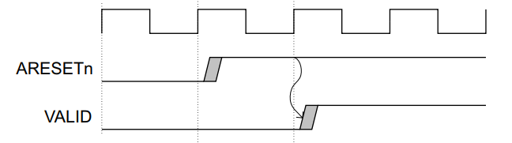

### 基本读写事务

#### 握手过程

五个事务通道都使用VALID/READY作为握手信号，传输地址、数据和控制信息，使用这种握手方式，主从双方都可以对传输速度进行控制。源端产生VALID信号意味着其地址、数据或控制信息有效，目的端产生READY信号意味着它可以接收信息，只有当双方的VALID与READY信号都为高时传输才会开始。

**在主从接口之间的输入输出信号间不能有组合路径。**

在下图中，源端在T1之后给出地址、数据或控制信息，并令VALID有效，在T2之后，目的端检测到VALID有效并给出READY有效信息，在T3阶段传输会发生，因此在T3阶段及之前，源端不能释放或改变需要传输的信息。

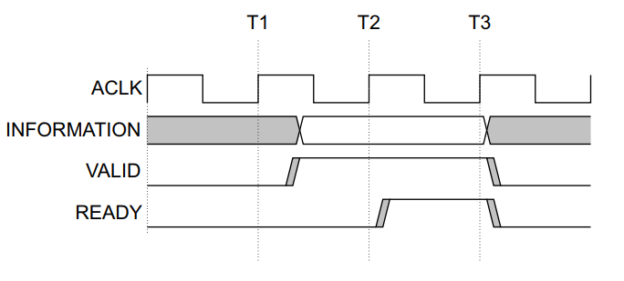

**源端必须在令VALID信号有效之后再等待READY信号有效，一旦VALID有效，源端必须等待握手发生，即在保持VALID不变的情况下，等待目的端的READY信号有效。**

在下图中，目的端首先在T1阶段之后令READY信号有效，源端在T2阶段之后给出地址、数据或控制信息，并令VALID有效，然后在T3阶段开始传输，在这种情况下，传输只消耗了一个时钟周期，而在上面那种情况下，则消耗了两个时钟周期。

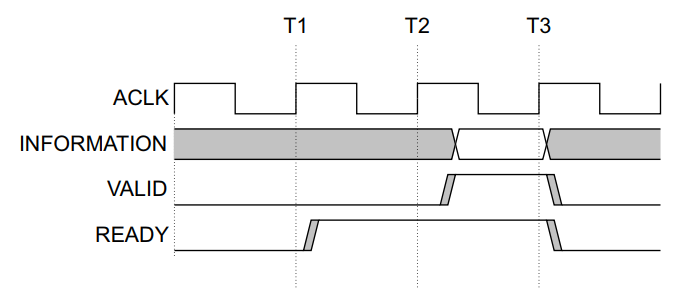

**目的端可以在自身READY信号无效的情况下，等待源端的VALID信号有效，这一条规则和上一条规则必须同时遵守，否则可能造成死锁等待，同时，在VALID有效前，即使READY已经有效，也可以再次令READY无效。**

在下图中，两端的VALID/READY信号同时有效，则传输立刻在下一个时钟周期开始：

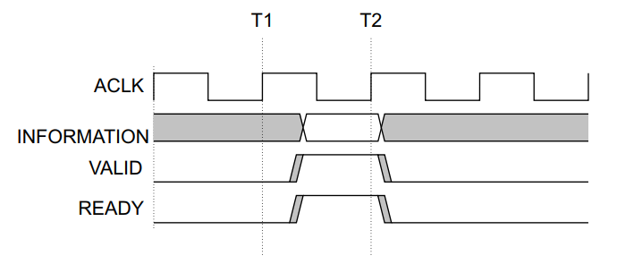

#### 通道信号需求

每个通道都有自己的握手信号对：

* 写地址通道：AWVALID/AWREADY。
* 写数据通道：WVALID/WREADY。
* 写响应通道：BVALID/BREADY。
* 读地址通道：ARVALID/ARREADY。
* 读数据通道：RVALID/RREADY。

写地址通道：

主设备仅当输出有效的地址和控制信息时才能使能AWVALID信号，在从设备的AWREADY信号有效后的第一个时钟上升沿，主设备的AWVALID信号必须保持有效。

AWREADY信号的默认状态可以为高也可以为低电平，规范推荐默认状态为高电平。当该信号为高电平时，意味着从设备一定可以接受任何有效的地址。

**注意：规范不推荐AWREADY信号默认为低电平是因为这会强制使传输周期拉长到至少两个时钟周期，一个周期用于使能AWVALID信号，另一个周期则用于使能AWREADY信号。**

写数据通道：

在写突发过程中，主设备可以仅当它输出有效数据时才使能WVALID信号，同样的，该信号必须在从设备WREADY信号有效后的第一个时钟上升沿保持有效。

WREADY信号默认可以为高电平，但这意味着从设备总是可以在一个时钟周期内接收待写入的数据。

主设备在进行突发事务中的最后一次写传输时，必须令WLAST信号有效。

写响应通道：

从设备输出有效的写响应信号后才能驱动BVALID信号，该信号在BREADY信号有效后的第一个时钟上升沿保持有效。

BREADY信号默认可以为高电平，但此时主设备必须总能在一个时钟周期内接收写响应。

读地址通道：

主设备仅当输出有效的地址和控制信息时才能使能ARVALID信号，在从设备的AWREADY信号有效后的第一个时钟上升沿，主设备的ARVALID信号必须保持有效。

ARREADY信号的默认状态可以为高也可以为低电平，规范推荐默认状态为高电平。当该信号为高电平时，意味着从设备一定可以接受任何有效的地址。

**注意：规范不推荐ARREADY信号默认为低电平是因为这会强制使传输周期拉长到至少两个时钟周期，一个周期用于使能ARVALID信号，另一个周期则用于使能ARREADY信号。**

读数据通道：

从设备只有在输出有效读数据时才能使能RVALID信号，同时在主设备的RREADY信号有效后的第一个时钟上升沿必须保持有效。**即使从设备只有一个读数据源，它也必须在收到数据请求时才令RVALID信号有效。**

主接口使用RREADY信号表示它可以接收数据，RREADY信号默认可以为高电平，但此时主设备启动读事务时必须能立即接收数据。

从设备在进行突发传输事务中的最后一次传输时必须使能RLAST信号。

### 通道间的关系

AXI协议要求各个通道间必须保持如下关系：

* 写响应必须紧跟在其所属的写事务的最后一次写传输之后。
* 读数据必须紧跟着它的地址之后。
* 通道握手必须符合通道握手依赖关系。

除此之外，协议没有规定其它的任何关系，这意味着，在一个事务中，写数据信号可以提前于写地址信号，这种情况通常发生在写地址的通道的寄存器阶段要更多时， 同样，写数据可以和写地址信号同时出现。

**注意：当互联器需要决定目标地址空间或从设备地址空间时，必须对地址和写数据重排，以确保写数据仅对其关联的从设备有效。**

### 通道握手信号依赖关系

为了避免死锁，下列依赖规则必须遵守：

在任何事务中：

* 发送信息的AXI接口的VALID信号不能依赖于接收信息的AXI接口的READY信号。
* 接收信号的的AXI接口在其自身的READY信号有效前可以等待对方的VALID信号。

**注意：VALID信号可以在READY信号之前有效，READY信号也可以在检测VALID信号之前有效，这些方式都会提升传输效率。**

在下面的依赖图中：

* 单头箭头指向的信号可以在始端信号有效前或有效后有效。
* 双头箭头指向的信号只有在始端信号有效后才能有效。

#### 读传输依赖

在读传输中：

* 主设备在使能ARVALID前不能等待从设备使能ARREADY。
* 从设备在使能自身的ARREADY前可以等待主设备使能ARVALID。
* 从设备可以在主设备使能ARVALID前使能ARREADY。
* 从设备在使能RVALID前必须等待ARVALID和ARREADY信号都使能。
* 从设备在使能RVALID后才能等待主设备使能RREADY。
* 主设备在使能RREADY前可以等待从设备使能RVALID。
* 主设备在从设备使能RVALID前可以使能RREADY。

总结就是：VALID信号发出方，必须首先使能VALID，才能等待READY信号；READY信号发出方，不必等待VALID有效，就可以发出READY信号，也可以等待VALID有效，再发出READY信号，同时，读数据通道的VALID信号不能保持常态有效。

依赖关系图如下：

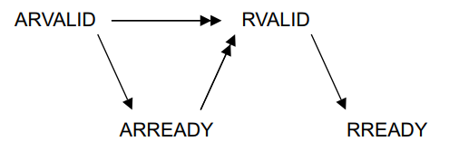

#### 写传输依赖

* 主设备在使能AWVALID或WVALID后才能等待从设备使能AWREADY或WREADY。
* 从设备在使能AWREADY前可以等待AWVALID或WVALID有效。
* 从设备在AWVALID或WVALID有效前可以先使能AWREADY。
* 从设备可以在使能WREADY前等待AWVALID与WVALID有效。
* 从设备在AWVALID或WVALID有效前可以先使能WREADY。
* 从设备必须等待WVALID与WREADY都有效后才能使能BVALID。
* 从设备必须等待WLAST有效后才能使能BVALID，因为写响应必须发生在一次写事务中的最后一次数据传输后。
* 从设备必须在使能BVALID后才能等待主设备使能BREADY。
* 主设备可以在使能BREADY前等待BVALID。
* 主设备可以在BVALID有效前使能BREADY。

依赖关系图如下：

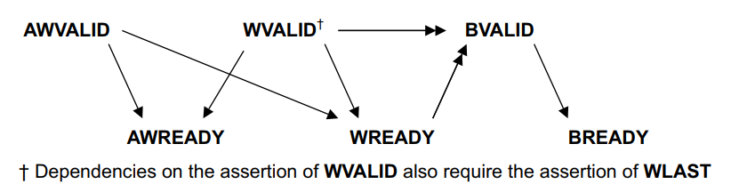

#### AXI4写响应依赖

注意：

* 该额外的依赖关系是AXI3所期望的，因为AXI3不希望任何组件在接收到有效的地址前接收写数据并提供写响应信号（由于AXI3允许写数据和写响应在写地址被接受前发出，因此AXI4从设备与AXI3从设备不完全兼容，而主设备则完全兼容，强烈推荐AXI3从设备按照更严格的AXI4写响应依赖图实现）。
* 通过发出写响应，从设备负责对写事务和所有后续事务进行冒险检查。

依赖关系如下：

* 主设备在使能AWVALID或WVALID后才能等待从设备使能AWREADY或WREADY。
* 从设备在使能AWREADY前可以等待AWVALID或WVALID有效。
* 从设备可以在使能WREADY前等待AWVALID与WVALID有效。
* 从设备在AWVALID或WVALID有效前可以先使能WREADY。
* 从设备等待AWVALID、AWREADY、WVALID、WREADY有效后才能使能BVALID。
* 从设备必须等待WLAST有效后才能使能BVALID，因为写响应必须发生在一次写事务中的最后一次数据传输后。
* 从设备必须在使能BVALID后才能等待主设备使能BREADY。
* 主设备可以在使能BREADY前等待BVALID。
* 主设备可以在BVALID有效前使能BREADY。

依赖关系图如下：

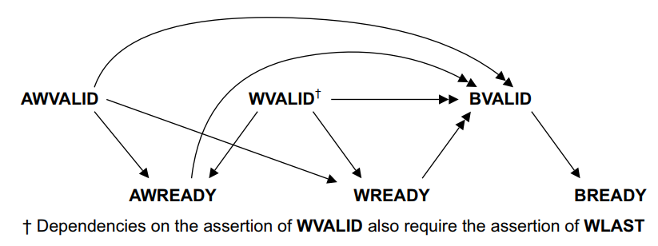

### 事务结构

#### 地址结构

AXI协议是基于突发的，主设备向从设备传送事务的控制信息和第一个字节的地址，然后，从设备必须在此后的每次传输中计算数据地址。

突发传输不能跨越4KB地址边界。

**注意：避免突发传输跨越两个从设备的边界，同时，必须使用从设备支持的地址增量。**

突发长度：

突发长度由下列字段指定：

* 对于读传输，ARLEN[7:0]。
* 对于写传输：AWLEN[7:0]。

AXI3支持1~16的突发长度。

AXI4：

* 对于INCR突发类型，支持1~256的突发长度。
* 对于其它突发类型，支持1~16的突发长度。

AXI3中的突发长度定义如下：

突发长度 = AxLEN[3:0] + 1

AXI4中的突发长度定义如下：

突发长度 = AxLEN[7:0] + 1

在使用突发传输时，必须遵守如下规则：

* 对于回绕传输，突发长度必须为2、4、8或16。
* 突发传输不能跨越4KB地址边界。
* 突发传输不支持过早结束。

在AXI4中，突发类型为INCR且突发长度大于16的突发传输可以转换为多个长度更短的突发传输，即使突发属性表明事务是不可修改的。在这种情况下，生成的突发事务必须保持与原始事务相同的事务特征，唯一的例外是：

* 突发长度变小。
* 突发地址被适当调整。

**注意：为了实现AXI3兼容性，将长突发传输转换为多个短突发传输是必要的，同时，这也可以减少长突发对QoS保证的影响。**

突发大小：

该字段表示每次突发数据传输或每个节拍中中数据的字节数，由以下字段指定：

* 对于读传输，ARSIZE[2:0]。
* 对于写传输，AWSIZE[2:0]。

突发大小 = 2^AxSIZE

如果AXI的总线比突发大小宽，AXI接口每次传输就必须根据地址判断使用哪几条数据线，任何一次传输的大小都不能超过事务中任一代理的数据总线宽度。

突发类型：

AXI协议定义了三种突发类型：

* 固定（FIXED）：在突发事务中，每次传输的地址一致，有效的字节线也是一致的，但是可以通过WSTRB信号控制实际有效的字节。这种方式通常用于对同一位置的重复访问，如读取或清空FIFO时。
* 递增（INCR）：在一次递增突发事务中，每次传输，地址都会在之前的地址基础上递增，递增量为传输大小。
* 回绕（WRAP）：这种类型和递增方式类似，但是，地址到达上界后，地址就会回绕到下界。

在回绕传输中，有几点需要注意：

* 起始地址必须对齐突发大小。
* 突发长度必须为2、4、8或16。

回绕突发方式的行为如下：

* 突发所使用的地址下界会对齐到传输数据的总量，这也被称为回绕边界。
* 在每次传输后，地址都会像递增突发方式一样递增，但是，一旦递增后的地址超过回绕边界，就会回到回绕边界的开始位置。
* 第一次传输的地址可以大于回绕边界的开始位置。

回绕突发方式通常用于Cache行的访问。

突发类型由如下字段指定：

* 对于读传输，ARBURST[1:0]。
* 对于写传输，AWBURST[1:0]。

字段取值如下：

| AxBURST[1:0] | 突发类型 |
| :----------: | :------: |
|      00      |  FIXED   |
|      01      |   INCR   |
|      10      |   WRAP   |
|      11      |   保留   |

#### 数据读写结构

**写选通：**

当WSTRB[i]为高电平时，对应的WDATA[(8i+7):8i]数据线有效，当WVALID为低电平时，写选通信号可以为任何值，不过标准推荐写选通信号全0或保持上一次的值。

**狭窄传输（Narrow transfer）：**

当主设备产生一个数据宽度小于数据总线的传输时，地址和控制信号按照如何方式决定使用哪些字节线：

* 在递增或回绕突发模式中，每拍使用不同的字节线。
* 在固定突发模式中，每拍使用相同的字节线。

**字节不变性（Byte invariance）：**

在访问单个存储器空间中的大小端混合数据时，AXI协议使用字节不变性大小端模式。

字节不变性大小端模式是指：

* 数据元素使用相同连续的内存字节，而不管数据的大小端如何。
* 大小端决定了存储器中的字节顺序，也就是说存储器中的第一个字节是数据元素的MSB还是LSB。
* 字节传输时，只需要将字节传输到地址给定的位置，而不需要考虑该字节是数据元素的哪一部分。

通常情况下，大多数小端组件可以直接连接到一个字节不变性接口，而只支持大端的组件则需要一个转换器。

**非对齐传输：**

AXI支持非对齐传输，对于任何数据宽度大于一个字节的突发传输而言，第一个字节的访问都可能是非对齐的。

一个主设备可以：

* 使用低位地址线发送一个非对齐的开始地址。
* 提供对齐的地址并使用字节选通信号线发送非对齐的开始地址。

注意：

* 低位地址线上的信息必须与字节选通信号提供的信息一致。
* 从设备不需要根据主设备传递的对齐信息执行任何特别的动作。

#### 数据读写响应结构

AXI协议提供了读写事务中的响应信号：

* 对于读事务而言，从设备在读数据通道上发送响应信息，使用RRESP[1:0]信号。
* 对于写事务而言，从设备在写响应通道上发送响应信息，使用BRESP[1:0]信号。

响应共有四种类型：

* OKAY：一般访问成功。该信号表示一个一般访问成功，也表示一个独占访问失败。
* EXOKAY：独占访问成功。
* SLVERR：从设备错误。该信号表示向从设备的访问已成功，但从设备希望向原始主设备返回一个错误条件。
* DECERR：译码错误。通常由互联器生成，表示根据给定的事务地址找不到从设备。

RRESP与BRESP的取值如下：

| RRESP/BRESP[1:0] |  响应  |
| :--------------: | :----: |
|        00        |  OKAY  |
|        01        | EXOKAY |
|        10        | SLVERR |
|        11        | DECERR |

对于写事务而言，只有当整个突发事务结束时才会发出一个响应。

对于读事务而言，从设备可以针对突发事务中的每个传输发送不同的响应。

协议规定，指定数量的数据传输必须全部被执行，即使发生了错误。

下面详细介绍不同的响应所对应的可能的情况：

OKAY响应可能在下列情况出现时产生：

* 一个一般访问成功。
* 一个独占访问失败。
* 独占访问指定的从设备不支持独占访问。

EXOKAY响应可能在下列情况出现时产生：

* 一个独占访问成功。

对于SLVERR响应，为了简化系统监控和调试，规范推荐这种错误响应只用于错误条件，而不用于除了事件外的一般通知，SLVERR响应可能在下列情况出现时发生：

* FIFO或缓冲区已满或已空。
* 尝试不支持的传输大小。
* 尝试写一个只读位置。
* 从设备超时。
* 尝试访问已禁用或已掉电功能。

对于DECERR响应，只有当互联器不能找到对应的从设备时才会返回。规范推荐互联器此时路由到一个默认的从设备，并由该默认从设备返回DECERR响应。

AXI协议要求事务中的全部数据传输必须都被完成，即使发生了错误，因此任何给定DECERR响应的组件满足这个需求。

## 事务属性

### 事务类型和属性

从设备可以分为以下两种类型：

* 存储器从设备：一个需要正确处理全部事务类型的存储器从设备。
* 外设从设备：一个外设从设备实现了定义的访问方法。通常，这被记载在组件的datasheet中。对于未定义的访问方法，外设从设备必须能够完成事务，但是规范并不要求从设备能够正确的完成所操作，它之要求从设备能够继续处理接下来的事务，这主要是为了避免系统发生死锁。

AXI协议定义了一整套支持存储器和外设从设备的事务属性，使用ARCACHE与AWCACHE信号来表示（后面使用AxCACHE指代这两个信号），这些信号控制事务通过系统进行的方式与系统级Cache处理事务的方式。

### AXI3存储器属性信号

在AXI3中，AxCache[3:0]指定了事务的可Buffer（Bufferable）、可Cache（Cacheable）与分配（Allocate）属性：

| AxCACHE |  值   |      事务属性       |
| :-----: | :---: | :-----------------: |
|   [0]   |  0/1  | 不可Buffer/可Buffer |
|   [1]   |  0/1  |  不可Cache/可Cache  |
|   [2]   |  0/1  | 不可读分配/可读分配 |
|   [3]   |  0/1  | 不可写分配/可写分配 |

可Buffer（B）是指，互联器或者其它任何组件是否可以让事务延迟任意个周期到达目的端，通常该属性仅与写请求相关。
可Cache（C）是指，传输分配是否被允许，以及原始事务特征是否一定匹配最终的事务特征，即多次写事务是否可以被合并（对于写事务）或某个位置的内容是否可以被预取（对于读事务）或某个读操作是否可以被分解为多个读事务（对于读事务）。
可读分配（RA）是指：是否推荐事务进行读分配，但不是强制的，当不可Cache时，该位必须为0。
可写分配（WA）是指：是否推荐事务进行写分配，但不是强制的，当不可Cache时，该位必须为0。

### AXI4对存储器属性信号的变更

AXI4做出了如下变更：

* AxCACHE[1]为重命名为可修改（Modifiable）位。
* 对于不可修改事务，定义了传输顺序要求。
* 更新了读分配和写分配的含义。

#### AxCACHE[1]，可修改

在AXI4中，AxCACHE[1]位为可修改位，当该位为高时，表示事务特征可修改，当改位为低时，表示事务特征不可修改。

**注意：该位仅仅是被重命名，因为新的名字能更好地描述该位的用途，而实际功能并未改变。**

不可修改事务：

一个不可事务传输不能分割为多个事务，也不能和其它事务合并，下表中的参数也不能被改变：

|   参数   |        信号        |
| :------: | :----------------: |
| 传输地址 | AxADDR以及AxREGION |
| 突发大小 |       AxSIZE       |
| 突发长度 |       AxLEN        |
| 突发类型 |      AxBURST       |
|  锁定类型  |       AxLOCK       |
| 保护类型 |       AxPROT       |

而AxCache信号仅被允许由可Buffer修改为不可Buffer，不允许其它的修改。

事务ID和QoS可被修改。

一个突发长度超过16的不可修改事务可被分割为多个事务，产生的事务仍然必须满足上述要求，除了：

* 突发长度减小。
* 突发地址被适当地修改。

对于独占的不可修改传输，在保持总访问字节数不变的情况下，允许修改AxSIZE与AxLEN。

注意：

* 存在一些无法满足不可修改事务需求的情况，例如，传输降级到更狭窄的总线时，事务的传输大小AxSIZE必须修改。
* 一个组件可以包含自定义的机制来通知事务特征发生了修改，这有助于软件调试。

可修改事务：

在可修改事务中，下列特征可以被修改：

* 一个事务可以被分割为多个事务。
* 多个事务可以被合并为一个事务。
* 一个读事务可以进行预取操作。
* 一个写事务可以访问比所需更大的地址范围，使用WSTRB信号以确保只有合适的位置被更新。
* 在每个生成的事务中，下列信号可以被修改：传输地址、突发大小、突发长度、突发类型。

下列特征不可以被修改：

* 锁定类型，AxLOCK。
* 保护类型，AxPROT。

存储器属性AxCACHE可以被修改，但是任何修改都必须确保事务的可见性不会因为阻止事务传播到所需的点或更改在Cache中寻找事务的需求而减少。任何对于存储器属性的修改都必须与相同地址范围内的其它事务一致。

传输ID和QoS可被修改。

当修改的结果出现如下情况时是不允许的：

* 导致访问与原始事务不同的4KB地址空间。
* 导致针对单次拷贝原子大小的区域的单次访问变为多次访问操作。

#### 不可修改事务的顺序要求

AXI4要求满足下列全部条件的任何事务集的顺序被保证：

* 事务是不可修改的。
* 事务使用了相同的AXI ID。
* 事务目标是相同的从设备。

无论事务的地址是什么，只要事务目标是同一个从设备，事务顺序都必须被保证。

**注意：当读写通道上分别出现独立的事务时，如果一个事务在另一个事务的响应被收到后才发出，则顺序可以被保证，否则顺序不能被保证。**

#### 读分配与写分配的更新含义

在AXI4中，读分配位表示事务中是否会发生分配，写分配位表示是否可能由于另一个事务而进行了分配。

对于读事务，写分配位被重定义用来表示：

* 由于先前的写事务，该位置可能已经预先在Cache中分配（就像AXI3所定义的那样）。
* 由于先前另一个主设备的行为，该位置可能已经预先在Cache中分配（AXI4的附加定义）。

对于写事务，读分配位被重定义用来表示：

* 由于先前的读事务，该位置可能已经预先在Cache中分配（就像AXI3所定义的那样）。
* 由于先前另一个主设备的行为，该位置可能已经预先在Cache中分配（AXI4的附加定义）。

这样变更意味着：

* 如果AxCACHE[3:2]不等于00，事务必须在Cache中查找。
* 如果AxCACHE[3:2]等于00，事务不需要在Cache中查找。

新的AWCACHE定义如下：

|    名称    |    AXI4定义    | 描述                                                                                                                                                                                                                                                                                                                                                                     |
| :--------: | :------------: | ------------------------------------------------------------------------------------------------------------------------------------------------------------------------------------------------------------------------------------------------------------------------------------------------------------------------------------------------------------------------ |
| AWCACHE[3] |    Allocate    | 当该位有效时，事务必须首先在Cache中查找，因为它可能被预先分配，同样的，如果AWCACHE[2]有效，事务同样需要预先在Cache中查找。而如果这两位都为0，事务则不必查找Cache。                                                                                                                                                                                                       |
| AWCACHE[2] | Other Allocate | 当该位有效时，事务必须首先在Cache中查找，因为它可能由于其它的事务，即读事务或来自另一个主设备的事务，在Cache中被预先分配。                                                                                                                                                                                                                                               |
| AWCACHE[1] |   Modifiable   | 当该位有效时，事务的特征可以修改，写事务可以被合并                                                                                                                                                                                                                                                                                                                       |
| AWCACHE[0] |   Bufferable   | 当该位无效时，如果AWCACHE[3:2]为00，写响应必须来自最终目的端。 当该位有效时，若AWCACHE[3:2]为00，写响应可以来自中间点，但写事务必须及时被最终目的端看到。 当该位无效时，如果AWCACHE[3:2]不为00，写响应可以来自中间点，但写事务必须及时被最终目的端看到。 当该位有效时，如果AWCACHE[3:2]不为00，写响应可以来自中间点，同时写传输可以不必被最终目的端看到。 |

新的ARCACHE定义如下：

|    名称    |    AXI4定义    | 描述                                                                                                                                                                                                                                                 |
| :--------: | :------------: | ---------------------------------------------------------------------------------------------------------------------------------------------------------------------------------------------------------------------------------------------------- |
| ARCACHE[3] | Other Allocate | 当该位有效时，事务必须首先在Cache中查找，因为它可能由于其它的事务，即写事务或来自另一个主设备的事务，在Cache中被预先分配，同样的，如果ARCACHE[2]有效，事务同样需要预先在Cache中查找。                                                                |
| ARCACHE[2] |    Allocate    | 当该位有效时，事务必须首先在Cache中查找，因为它可能被预先分配。                                                                                                                                                                                      |
| ARCACHE[1] |   Modifiable   | 当该位有效时，事务的特征可以修改，写事务可以被合并。                                                                                                                                                                                                 |
| ARCACHE[0] |   Bufferable   | 当ARCACHE[3:1]为000时该位无用。 当ARCACHE[3:2]为00且ARCACHE[1]为1时，若该位无效，则读取的数据必须来自最终目的端，否则可以来自一个指向该目的端正在处理的写事务。 当ARCACHE[3]有效或ARCACHE[2]有效时，该位可以用来区分写穿和写回存储器类型。 |

### 存储器类型

下列的表中给出了AxCACHE的编码含义，其中有的类型拥有两种编码，其中括号内的是AXI3所采用的编码，其它则为AXI4所采用的编码，这主要是为了让AXI4具有向下兼容能力：

| ARCACHE[3:0] | AWCACHE[3:0] |          存储器类型           |
| :----------: | :----------: | :---------------------------: |
|     0000     |     0000     |        不可Buffer设备         |
|     0001     |     0001     |         可Buffer设备          |
|     0010     |     0010     | 一般不可Cache不可Buffer存储器 |
|     0011     |     0011     |  一般不可Cache可Buffer存储器  |
|     1010     |     0110     |      写穿不可分配存储器       |
|  1110(0110)  |     0110     |      写穿可读分配存储器       |
|     1010     |  1110(1010)  |      写穿可写分配存储器       |
|     1110     |     1110     |     写穿可读写分配存储器      |
|     1011     |     0111     |      写回不可分配存储器       |
|  1111(0111)  |     0111     |      写回可读分配存储器       |
|     1011     |  1111(1011)  |      写回可写分配存储器       |
|     1111     |     1111     |     写回可读写分配存储器      |

### 不同的存储器属性

访问存储器相同区域的多个代理可以使用不同的内存属性，然而，为保证功能正确性，必须遵守如下几条规则：

* 所有访问存储器相同区域的主设备都必须拥有该区域的一致性可Cache视图，也就是说，要么这些主设备的AxCACHE[3:2]均为00，或均为非00。
* 不同的主设备可以使用不同的可分配暗示信号。
* 如果一个寻址区域是一般不可Cache的，任何主设备都可以使用设备存储器事务方式访问。
* 如果一个寻址区域是可Buffer的，任何主设备都可以使用不可Buffer的方式访问。

#### 改变存储器属性

一个特定存储器区域的属性可以被改变，不过这需要一个合适的流程来执行，通常如下所示：

1. 所有的主设备停止访问该区域。
2. 某个主设备执行Cache维护操作。
3. 所有的主设备使用新属性重启对该区域的访问。

### 访问权限

AXI提供了访问权限信号用以阻止非法事务：

* ARPROT[2:0]定义了读访问的访问权限。
* AWPROT[2:0]定义了写访问的访问权限。

其中，信号定义如下：

| AxPROT |  值   |        功能         |
| :----: | :---: | :-----------------: |
|  [0]   |  0/1  | 非特权访问/特权访问 |
|  [1]   |  0/1  | 安全访问/不安全访问 |
|  [2]   |  0/1  |  数据访问/指令访问  |

#### 非特权与特权访问

一些处理器支持多种特权级，但是AXI仅支持两种特权级，具体的映射方法可以参照具体处理器的文档。

#### 安全与非安全访问

该定义与ARM安全扩展中所定义的一致。

#### 指令与数据

在AXI协议规范中，该位仅仅是一种暗示，例如，若某个事务包含指令和数据的混合项，则推荐将该位设置为0，表示当前进行的是数据访问而不是指令访问。

### 遗留问题

AXI4在处理一些AxCACHE存储器属性时引入了额外的要求。

在AXI4中，所有使用相同ID且目的从设备相同的设备事务都必须按序排列。

注意：

* 这并不是AXI3的要求，任何依赖该行为的AXI4组件都不能连接到不支持该特性的AXI3互联器上。
* ARM相信大多数的AXI3互联器都支持所需的AXI4行为。

该规范强烈推荐任何新的AXI3设计都应该实现AXI4的要求。

对于AxCACHE位名和存储器类型名，AX3组件可以使用AXI3或AXI4的名字。

## 多事务

### AXI事务标识符

AXI协议包含AXI ID事务标识符，主设备可以使用这个区分需要按序返回的事务。

AXI ID相同的事务必须保证顺序，但是AXI ID不同的事物则不能保证顺序，这意味着单个物理端口可以支持乱序事务，并据此模拟出多个逻辑端口，其中每个端口都是按序端口。

使用AXI ID，主设备可以在前面事务未完成的时候就发送新的事务，这可以提升系统效率，因为这允许事务的并行处理。

**注意：这并没有要求主设备和从设备一定使用AXI事务ID，主设备和从设备可以同时只处理一个事务，这意味着所有的事务都是按序的，同时从设备返回的BID和RID必须和主设备发出的AXI ID一致。**

### 事务ID

每一个事务通道都拥有自己的事务ID，如下表所示：

|      事务通道      | 事务ID |
| :----------------: | :----: |
|     写地址通道     |  AWID  |
| 写数据通道，仅AXI3 |  WID   |
|     写响应通道     |  BID   |
|     读地址通道     |  ARID  |
|     读数据通道     |  RID   |

**注意：AXI4协议支持基于AXI ID的扩展顺序模型。**

### 事务顺序

主设备可以使用AWID和ARID事务ID信号来表明它的顺序要求，具体情况如下：

* 来自不同主设备的事务是不需按序的。
* 来自相同主设备但ID不同的事务是不需按序的。
* 具有相同ARID的一系列读事务的数据传输必须按照主设备发出地址的顺序返回。
* 具有相同AWID的一系列写事务的数据传输必须按照主设备发出地址的顺序返回。
* 在AWID与ARID使用相同值的读写事务之间是不需按序的。

**注意：AXI3因为支持写数据交错，因此写数据通道中才含有WID信号，而在AXI4中，写数据的顺序必须和写地址的顺序一致，因此WID信号被移除。**

#### 事务ID信号的宽度

事务ID信号的宽度可以任意定义，然而，规范推荐下列事务ID信号宽度：

* 主设备实现至多4bit的事务ID。
* 互联器增加额外的至多4bit的事务ID用于支持多主端口。
* 从设备实现8bit的事物ID信号支持。

对于只支持单个按序接口的主设备，将事务ID信号置为一个常量，例如0，是可以接受的。

对于不使用顺序信息而将所有事务按序处理的从设备而言，事务ID信号可以在不改变从设备功能的情况下被加入。

#### 遗留问题

大多数AXI3主设备不支持写交错，因此为了满足AXI4的要求不需要做任何改动，而支持写交错的AXI主设备必须要支持写交错深度的配置方法，通过将写交错深度设置为1来兼容AXI4。

**注意：任何需要WID信号的AXI3的组件都可以从AWID信号生成WID信号。**

## AXI4顺序模型

### 顺序模型的定义

AXI4协议支持基于AXI ID事务标识符的顺序模型。

对于相同ID的事务来说：

* 到任何单个外设的事务顺序必然与事务被发出的顺序一致。
* 使用相同或重叠地址的存储器事务的到达顺序必然与事务被发出的顺序一致。

**注意：在拥有多个主设备的AXI系统中，AXI ID中包含主设备的标识符，这意味着对于顺序模型对于每个主设备而言是独立的。**

AXI顺序模型同时要求所有相同方向且AXI ID一致的事务的响应顺序必须与事务发出顺序一致。

因为读地址和写地址通道是独立的，如果需要让不同方向具有相同ID的事务有顺序关系，主设备就必须在发出第二个事务之前等待接收第一个事务的响应，否则是没有顺序保证的，注意在这种情况下，主设备必须要保证收到的响应来自一个合适的点，一个来自中间AXI组件（如互联器）的响应不能保证组件Buffer下游的组件收到事务的顺序。

### 主设备顺序

一个在相同方向发送携带有相同ID的事务时可以得到如下的顺序保证：

* 事务的响应顺序与发出顺序一致。
* 对于到设备存储器的事务，事务到达从设备的顺序必然与发出顺序一致。
* 对于一般存储器，当事务的地址相同或有重叠时，到达的顺序必然与发出顺序一致，这同样针对于可Cache的存储器，即应用于所有AxCACHE[3:1]不为全0的存储器。

所谓事务的地址相同或有重叠，指的是事务在相同的单拷贝原子地址范围内至少有一个字节发生重叠。

### 互联器顺序

为了满足顺序模型的要求，互联器必须保证以下几点：

* 具有相同ID相同方向的、发向设备存储器的事务顺序要保证。
* 具有相同ID相同方向的、相同或重叠地址的事务顺序要保证。
* 相同ID事务的写响应顺序要保证。
* 相同ID事务的读响应顺序要保证。
* 任何对AXI ID值的操作都必须保证新的事务依然保持相同的顺序。
* 在事务到达其最终目的地之前，任何提供响应的组件都必须确保在事务到达其目的端之前都要维护本节给出的顺序要求。

### 从设备顺序

为了满足顺序模型的要求，从设备必须保证以下几点：

* 任何已经发出响应的写事务都必须能被任何后续的读或写事务所观察到，无论其事务ID是什么。
* 在相同事务ID的情况下，任何针对于设备存储器的写事务都必须能够被任何后续针对设备存储器的写事务观察到，无论响应是否发出。
* 在相同ID的情况下，任何针对一般存储器的写事务都必须能被后续针对相同或重叠地址的写事务观察到，无论响应是否发出，这同样也适用于可Cache存储器，即AWCACHE[3:1]不为0的存储器。
* 针对相同ID的多个写事务的响应的发送顺序必须与事务的到达顺序一致。
* 针对不同ID的多个写事务的响应的发送顺序可以是任意的。
* 任何已经发出响应的读事务都必须能够被任何后续的读或写事务所观察到，无论其事务ID是什么。
* 在相同事务ID的情况下，任何针对于设备存储器的读事务都必须能够被任何后续针对设备存储器的读事务观察到，无论响应是否发出。
* 针对相同ID的多个读事务的响应的发送顺序必须与事务的到达顺序一致。
* 针对不同ID的多个读事务的响应的发送顺序可以是任意的。

### 在目的端之前发出响应

任何中间组件都可以在事务到达目的端之前发出响应，但必须确保，对于任何其它来自上游主设备的事务而言，该事务的可见性。

当访问全部类型的存储器时，任何针对相同或重叠地址的新事务都必须能够观察到中间组件发出响应对应的事务。

当访问设备存储器时，中间组件必须维护任何具有相同ID以及到相同从设备的事务的顺序。

只有当事务的AxCACHE属性表明中间组件可以直接发出响应时，中间组件才可以发出响应。

AXI协议要求，针对设备存储器的访问顺序保证是针对一般存储器的访问顺序保证的超集，这意味着当任何标记为一般存储器访问类型的事务被转换为设备存储器访问类型时不需要移除任何原先的顺序保证，为了满足这个要求，针对相同或重叠地址的设备存储器的访问行为必须与一般存储器访问行为一致，无论其ID是什么。

下表给出了不同存储器类型在ID是否相同、地址是否重叠不同组合下的顺序要求。

| 存储器类型 | ID是否相同 | 地址是否重叠 | 是否要求顺序 |
| :--------: | :--------: | :----------: | :----------: |
| 设备存储器 |     是     |      是      |      是      |
| 设备存储器 |     是     |      否      |      是      |
| 设备存储器 |     否     |      是      |      是      |
| 设备存储器 |     否     |      否      |      否      |
| 一般存储器 |     是     |      是      |      是      |
| 一般存储器 |     是     |      否      |      否      |
| 一般存储器 |     否     |      是      |      是      |
| 一般存储器 |     否     |      否      |      否      |

这里说的一般存储器，同样适用于可Cache存储器，即AxCACHE[3:1]不为全0的存储器。

### 观察顺序

为了提升接口对不同顺序模型接口协议的兼容性，规范提供了Ordered_Write_Observation属性，该属性可针对单个接口设置为True或False，如果该属性设置为True，说明该端口拥有该属性，否则说明该接口不支持该属性。

一个支持Ordered_Write_Observation属性的接口可以支持生产者/消费者顺序模型以提升效率。

如果两个拥有相同ID的写事务可以被系统中的其它代理以与事务发出顺序相同的顺序观察到事务，则该接口可以声称其提供了Ordered_Write_Observation支持。

如果一个接口不支持Ordered_Write_Observation特性，则仅能保证针对相同ID到相同外设的写事务顺序。为了在这种情况下支持生产者/消费者顺序模型，在后续针对不同外设的写事务发出前，必须通过BRESP等待接收前一个写事务的响应。

## 原子访问

### 单拷贝原子大小

AXI4协议引入了单拷贝原子大小的概念，这个术语定义了一个事务原子更新的最小字节数。AXI4协议要求大于一个单拷贝原子大小的事务必须更新至少为单拷贝原子大小的内存块。

**注意：原子性并不定义数据更新的确切时刻。必须确保的是，没有一个主设备可以观察到原子数据的部分更新形式。例如，在使用许多系统数据结构例如由32bit原子元素构成的链表时，针对这些元素的原子更新操作必须同时更新整个32bit的值，任何一个主设备在某个时刻只观测到其中的16bit发生更新，而在另一个时刻观测到另外16bit发生更新的的这一行为是不可接受的。**

更复杂的系统要求支持更大的原子元素，特别是64bit原子元素，以便主设备可以使用基于更大原子元素的数据结构通信。

系统所支持的单拷贝原子大小非常重要，因为给定通信中设计的所有组件都必须支持苏偶像的原子元素大小。如果两个主设备正在通过互联器和同一个从设备通信，则所有涉及到的组件都必须确保所需大小的事务被原子对待。

AXI4协议不要求特定的单拷贝原子大小，系统可以支持不同的单拷贝原子大小。

对于组内通信，不同的组件组可以拥有不同的单拷贝原子大小，在AXI4中，单拷贝原子组这一术语指的是一组可以以特定的原子性进行通信的组件。

下图展示了如下的一个系统：

* 处理器、DSP、DRAM控制器、DMA控制器、外设、SRAM以及关联的互联器都在一个32bit的单拷贝原子组中。
* 处理器、DSP、DRAM控制器以及关联的互联器也在一个64bit的单拷贝原子组中。

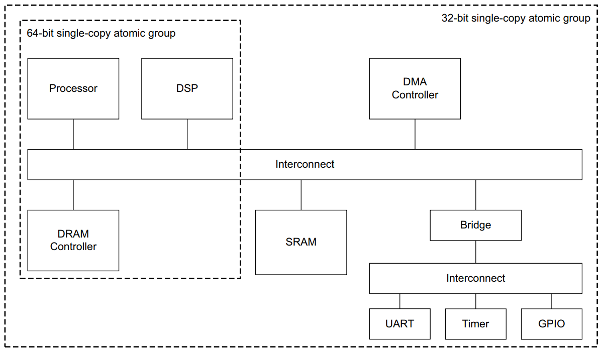

事务的原子性只有在它的起始地址正确对齐时才能得到保证，例如，对于一个64bit的单拷贝原子组来说，如果突发事务的地址没有对齐到8字节边界，那么该事务就没有任何64bit单拷贝原子保证。

事务的字节选通信号不会影响单拷贝原子大小。

#### 多拷贝写原子性

要指定一个系统提供多拷贝原子性，必须定义Multi_Copy_Atomicity属性。

如果这个属性被设置为True，则该系统拥有这个能力，否则该系统不拥有这个能力。

如果以下条件满足，则可以说明一个系统具有多拷贝原子性：

* 针对同一个位置的写操作可以被所有的代理以相同的顺序观察到。
* 对于一个除发出者外的代理可以观测到的写操作而言，其它的代理也都能观测到。

多拷贝原子性可以通过如下手段来保证：

* 对于一个给定的地址使用单点序列化（POS），这样针对相同位置的全部访问操作都可以按序处理器，必须确保在该位置的新值针对任何代理都可见之前将被Cache的一致性拷贝全部无效化。
* 避免在代理的上游使用前向Buffer，这可以避免一个Buffer写操作在对全部代理可见前对某些代理可见。

**注意：如果一个系统使用了ARM v8架构处理器，则该系统必须拥有Multi_Copy_Atomicity属性。该属性用来支持获取加载和释放存储指令，释放存储指令要求存储操作是多拷贝原子性的。**

### 独占访问

独占访问机制提供了信号量类型的操作，利用该机制时，不需要在整个访问周期内让总线被一个主设备所独占，这意味着信号量类型操作不会影响总线访问延迟以及最大可实现带宽。

AxLOCK信号选择独占访问，RRESP和BRESP信号则分别表示独占读和独占写操作的成功与否。

从设备要求额外的逻辑实现独占访问，当主设备访问一个不支持独占访问的从设备时，AXI协议提供了一种机制用来通知该主设备其所访问的从设备不支持独占访问操作。

#### 独占访问过程

独占访问的基本机制如下：

1. 主设备在给定地址上执行独占读事务。
2. 过一段时间后，主设备尝试在相同的地址上执行独占写事务，这会导致独占读事务的完成，同时，独占写事务的AWID与独占读事务的ARID相同。
3. 如果从执行独占读事务开始没有其它主设备写相同的位置，独占写事务将会更新存储器，并返回成功信号，否则会返回失败信号。

主设备或许不会完成独占事务的写部分，独占访问监视硬件对于每一个事务ID只会监视一个地址。如果一个主设备没有完成独占事务的写部分，接下来这个主设备又以相同的事务ID对另一个地址发起了独占读事务，则独占访问监视的地址就会被改变。

#### 从主设备视角看待独占访问

一个主设备通过执行一个独占读事务的方式开始一个独占操作，如果事务成功，从设备就会返回EXOKAY响应，表示从设备已经记录了要监视的地址。

如果主设备尝试向不支持独占访问的从设备发出独占读事务请求，从设备会返回OKAY响应而不是EXOKAY响应。

**注意：主设备可以将OKAY响应作为独占访问不支持的错误响应看待，规范推荐主设备接下来不要执行独占操作的写部分。**

在独占读操作之后的一段时间后，主设备尝试对相同位置发起独占写事务，如果从独占读事务开始时到现在对应地址的内容始终没有发生改变，独占写操作就会成功，从设备返回EXOKAY响应，并更新对应的存储器位置，否则，独占写操作就会失败，从设备返回OKAY响应而不是EXOKAY响应，独占写操作不会更新对应的存储器位置。

主设备或许不会完成独占操作的写部分，如果发生了这种情况，从设备将会继续监视独占访问的地址直到针对该从设备的另一个独占读事务启动一个新的独占访问序列。

主设备在独占访问序列的读部分完成后才会开始独占访问序列的写部分。

#### 从从设备视角看待独占访问

不支持独占访问的从设备可以忽略AxLOCK信号，这样的从设备对于一般和独占访问都必须提供OKAY响应信号。

支持独占访问的从设备必须拥有监视硬件，规范推荐对于每一个支持独占的事务ID而言都准备一个监视单元。ARM规范参考手册，ARMv7-A和ARMv7-R版本定义了一种独占访问监视器，一个单端口的从设备可以拥有一个外接的独占访问监视器，而一个多端口的从设备则或许需要实现内部监视器。

独占访问监视器需要记录任何独占读操作的地址和ARID，然后需要监视指定的位置，直到针对该位置的写操作发生或者使用相同ARID的另一个独占读操作复位监视器并将地址设置为另一个值。

当从设备接收到一个独占写事务时，监视器就会根据给定的AWID检查指定的地址是否被监视，如果是，这表示从独占读操作开始以来没有发生写操作，然后就会处理写操作并完成整个独占访问过程，返回EXOKAY响应，并更新存储器。

如果在进行独占写时，地址不再被相同AWID的监视硬件监视，则表明发生了下列情况之一：

* 在独占读访问事务发起之后，对应的位置的内容被更新。
* 监视器的地址被另一个独占读事务重置修改。

在以上两种情况中，独占写事务都不会更新对应的存储器位置，从设备必须返回OKAY而不是EXOKAY响应。

#### 独占访问限制

独占访问存在以下限制：

* 独占写操作的突发大小和突发长度必须与其对应的独占读操作一致。
* 独占访问的地址必须对齐到事务的总字节数，也就是突发大小与突发长度的乘积。
* 独占读与独占写事务的地址必须一致。
* 独占读事务的ARID必须与独占写事务的AWID一致。
* 独占读和独占写事务的控制信号必须一致。
* 独占访问突发传输的字节数必须是2的幂，即1、2、4、8、16、32、64或128字节。
* 独占访问突发传输的最大字节数为128字节。
* 在AXI4中，独占访问的突发长度不能超过16。
* AxCACHE信号的值必须保证监视独占访问的从设备可以看到事务。例如，独占访问事务的AxCACHE的值一定不表示事务是可Cache的。

不遵守这些限制将会导致**不可预测**的结果。

在独占操作过程中监视的最小字节数由事务的突发长度和突发大小所定义，而从设备可以选择监视更大的字节数（最大不超过128字节），但当相邻的字节被更新时，这会导致本应成功的独占访问操作变为失败状态。

#### 不支持独占访问的从设备

RRESP与BRESP响应信号在表示一般访问成功时使用OKAY信号，而在表示独占访问成功时使用EXOKAY信号，这意味着不支持独占访问的从设备会使用OKAY信号表示独占访问操作的失败。

注意：

* 针对不支持独占访问从设备的独占写操作总会更新存储器。
* 针对支持独占访问从设备的独占写操作只有在独占写操作成功时才会更新存储器。

### 锁定访问

AXI4不支持锁定事务，而AXI3实现则必须支持锁定事务。

AXI4由于以下原因移除了锁定事务的支持：

* 大多数组件不需要锁定事务。
* 锁定事务的实现会对互联器的复杂度以及QoS保证能力造成显著的影响。

当主设备使用AxLOCK信号表示当前事务是一个锁定事务时，互联器就必须确保只有当前主设备可以访问目标从设备区域，直到该主设备发出解锁事务为止，互联器的仲裁器必须强制执行此限制。

在主设备开始读事务或写事务的锁定序列前，该主设备必须确保没有其它等待完成的事务。

任何携带AxLOCK信号的事务都是锁定事务，这会强制互联器锁定接下来的事务，因此，一个锁定序列只有当主设备发出无AxLOCK信号事务时才会终止，这个终止事务包含在锁定序列中并实际上移除了锁。

在即将完成锁定序列时，必须首先确保所有的锁定事务都已经完成，然后才能发出终止解锁事务，并必须确保在进行接下来的任何事务之前该解锁事务已经执行完成。

主设备必须确保一个锁定序列中的全部事务都拥有相同的AxID值。

**注意：锁定访问事务需要互联器在锁定序列进行中时避免任何其它的事务发生，这会对互联器的效率产生影响，因此，该规范推荐锁定访问事务只用于支持早期设备。**

该规范推荐下列的限制（但不是强制性的）：

* 在单个4KB地址域内保持任何锁定事务序列。
* 将任何锁定任务序列限制为两个事务。

### 原子访问信号

在AXI3中，AxLOCK信号用于指定一般、独占和锁定访问，下表为AXI3规范对于AxLOCK信号的编码：

| AxLOCK[1:0] | 访问类型 |
| :---------: | :------: |
|     00      | 一般访问 |
|     01      | 独占访问 |
|     10      | 锁定访问 |
|     11      |   保留   |

AXI4移除了锁定事务，仅使用1bit锁定信号，下表为AXI4规范对于AxLOCK信号的编码：

| AxLOCK | 访问类型 |
| :----: | :------: |
|   0    | 一般访问 |
|   1    | 独占访问 |

#### 遗留问题

在AXI4环境中，任何AXI3锁定事务可以按照下列方式被转换：

* AWLOCK[1:0] = 10被转换为一般写事务，AWLOCK = 0。
* ARLOCK[1:0] = 10被转换为一般读事务，ARLOCK = 0。

该规范推荐任何组件执行这样的转换，一般是互联器，可以包含一个可选的机制用于检测和标记这样的事务发生。

如果某些组件执行了这样的转换后不能正确工作，则这样的组件不能在AXI4环境中使用。

**注意：对于许多早期使用锁定事务的例子，例如SWP指令的执行，或许需要通过修改软件的方式来避免使用强制使用锁定事务的指令。**

## AXI4附加信号

### QoS信号

#### QoS接口信号

AXI4信号集支持两个4bit的QoS标识符：

* AWQOS：一个4bit的QoS标识符，在每次写事务中由写地址通道发送。
* ARQOS：一个4bit的QoS标识符，在每次读事务中由读地址通道发送。

协议并没有指定QoS标识符的精确使用方法，规范推荐AxQOS的值用于优先级指示器，更大的值表示更高优先级的事务。

当使用默认值0000时表示接口不参与任何QoS方案。

#### 主设备问题

一个主设备可以产生自己的AxQOS值，如果它可以产生多个传输流，则可以为这些流分配不同的QoS值。

为了支持QoS，需要对正在使用的QoS方案有系统级的理解，同时需要全部的组件之间互相配合，因此，规范推荐主设备组件支持精确控制QoS值的机制用于任何给定的场景。

如果主设备组件不支持任何可编程的QoS方案，则它可以使用QoS值代表事务的相对优先级，然后可以将这些值映射到备用的系统级QoS值。

不能产生AxQOS值的主设备必须使用默认值。

**注意：规范期望一些互联组件实现一些可编程寄存器，这些寄存器可以用于分配QoS值到连接的主设备，覆盖掉主设备原先的QoS值。**

#### 系统问题

AXI4中定义的QoS信号可以用于任何兼容的系统级QoS方法。

QoS默认的系统级实现是，任何组件可以选择处理多个事务时，都会选择QoS值较高的事务优先处理。这个选择仅当没有其他要求事务需要按特定顺序处理的约束时才会发生。

**注意：这意味着AXI顺序规则优先于QoS。**

可以实现兼容默认方案的更复杂的QoS方案。

### 多区域信号

#### 附加接口信号

AXI4接口信号集支持两个4bit区域标识符（可选）：

* AWREGION：一个区域标识符，在每次写事务中由写地址通道发送。
* ARREGION：一个区域标识符，在每次读事务中由读地址通道发送。

4bit区域标识符可以用于唯一地标识16个不同的区域，区域标识符可以提供更高阶的地址位译码，但在任何4KB地址空间内必须保持不变。

区域标识符的使用意味着从设备的单个物理接口可以提供多个逻辑接口，每一个都位于系统地址映射中的不同位置，区域标识符的使用也意味着从舍尔必不支持不同逻辑接口间的地址译码。

这个协议期望互联器在为拥有多个逻辑接口的单个从设备执行地址译码功能时产生AxREGION信号，如果一个从设备在系统地址映射中只有一个物理接口，则互联器必须使用默认的AxREGION值。

从设备必须确保两个位于不同区域但拥有相同的AXI ID的事务以正确地顺序响应。

如果从设备实现的区域少于16个时，从设备必须确保在任何主设备尝试访问不支持的区域时给出正确的协议信号，而这需要具体实现自行定义，例如，从设备或许需要通过下列方式来确保上述事宜：

* 对于任何访问不支持区域的事务提供一个错误响应。
* 为所有不支持的区域分配支持区域的别名，以确保响应符合协议。

AxREGION信号仅提供了对从设备可使用的现存地址空间的地址译码功能，以消除对地址译码功能的需求，这个信号并没有创建新的独立地址空间。

AxREGION只能出现在地址译码功能的下游接口上。

### 用户定义信号

AXI4接口信号集在每个通道上包含了一些用户定义信号，一般情况下，规范推荐用户不使用用户信号，因为AXI协议并没有定义这些信号的功能，贸然使用可能会导致两个组件之间出现互操作性的问题，因为两个组件可能以不兼容的方法使用了相同的用户信号。

#### 信号命名

每个AXI4通道定义的用户信号名称如下：

* AWUSER：写地址通道用户信号。
* ARUSER：读地址通道用户信号。
* WUSER：写数据通道用户信号。
* RUSER：读数据通道用户信号。
* BUSER：写响应通道用户信号。

#### 使用问题

协议并不要求所有通道都支持用户信号。

规范推荐互联器包含用户信号，然而，并没有要求主设备和从设备包含用户信号。

规范推荐互联组件包含用户信号的支持，以便互联组件可以将用户信号在主设备和从设备之间传送，用户定义信号的宽度是具体实现定义的，对于每个通道都可以是不同的。

## 低功耗接口

### 关于低功耗接口

低功耗接口是AXI协议的可选扩展，以如下两类外设为目标：

* 任何没有下电序列且可以指示其时钟何时被关闭的外设。
* 任何要求下电序列，且只有在进入低功耗状态后才能停止时钟的外设，这样的外设要求系统时钟控制器指示其何时开始下电序列，并且外设在进入低功耗状态后必须发出通知信号。

### 低功耗时钟控制

低功耗时钟控制接口包含如下信号：

* 一个来自外设的信号用于指示其时钟何时可以被开启关闭。
* 两个为系统时钟控制器准备的握手信号用于请求进入或退出低功耗状态。

#### 外设时钟要求

CACTIVE信号表示外设是否需要时钟信号，当外设需要时钟使能的时候就会拉高CACTIVE信号，此时系统时钟控制器就必须立即使能时钟。当外设不需要时钟的时候就会拉低CACTIVE信号，系统时钟控制器可以关闭该时钟，但也可以不关闭。

如果一个外设在任何时候都允许其时钟被使能或禁用，则可以永久性地拉低CATIVE信号，若一个外设要求其时钟永久使能，则必须永久性地拉高CACTIVE信号。

CACTIVE仅用于没有下电或上电序列支持的某些外设的时钟控制。

#### 下电或上电握手

对于一个拥有下电或上电序列的外设而言，只有在系统时钟控制器发出请求之后外设才会进入低功耗状态，AXI协议提供了请求/响应握手信号用于支持这个功能：

* CSYSREQ：系统时钟控制器使用CSYSREQ信号请求外设进入低功耗状态（拉低CSYSREQ信号）或退出低功耗状态（拉高CSYSREQ信号）。
* CSYSACK：外设使用CSYSACK信号通知系统时钟控制器已完成请求，对于进入低功耗状态请求，外设会拉低CSYSACK信号，对于退出低功耗状态请求，外设会拉高CSYSACK信号。

下列是这CSYSREQ与CSYSACK信号的时序图：

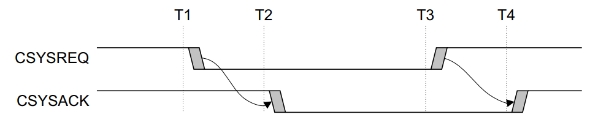

在序列开始时，CSYSREQ与CSYSACK信号都为高电平，在T1时刻，系统时钟控制器拉低CSYSREQ表示请求外设进入低功耗状态，外设在T2时刻拉低CSYSACK信号响应请求，在T3时刻，系统时钟控制器拉高CSYSREQ信号请求外设退出低功耗状态，在T4时刻，外设拉高CSYSACK信号响应请求。

外设可以同意或拒绝系统时钟控制器进入低功耗状态的请求，在外设响应请求的时候通过将CACTIVE信号拉高或拉低来表示接受或拒绝请求。

#### 接受低功耗请求

下图是外设接受系统低功耗请求时的时序图：

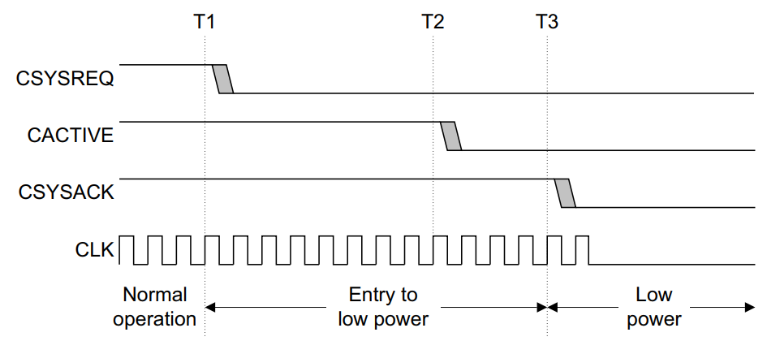

在T1时刻，系统时钟控制器拉低CSYSREQ信号以请求外设进入低功耗状态，在外设识别到这个请求后，执行了自己的下电序列，并在T2时刻拉低了CACTIVE信号用来表示时钟信号可以被移除。在T3时刻，外设拉低CSYSACK信号通知系统时钟控制器该外设已进入低功耗模式，

外设只有在拉低CACTIVE至少一个时钟之后才能拉低CSYSACK信号。

#### 拒绝低功耗请求

下图是外设拒绝系统低功耗请求时的时序图：

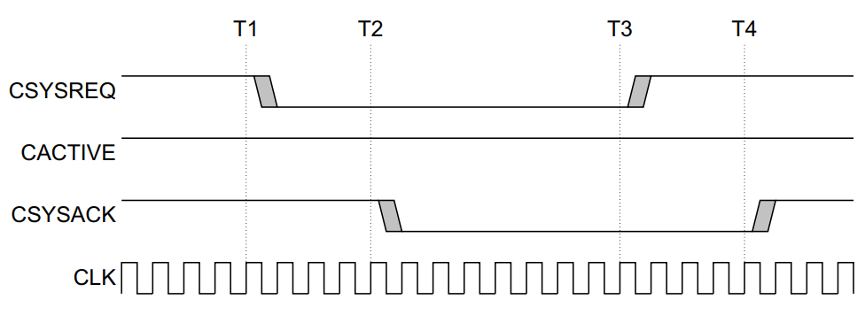

在T1时刻，系统时钟控制器拉低CSYSREQ信号以请求外设进入低功耗状态，在T2时刻外设响应该请求，但此时仅拉低了CSYSACK信号而并没有拉低CACTIVE信号，因此系统时钟控制器必须维持时钟，并且在执行了低功耗状态退出序列后才能发起另一个低功耗请求。在T3时刻，系统时钟控制器通过拉高CSYSREQ开始了低功耗状态退出序列，在T4时刻，外设拉高CSYSACK表示完成了低功耗状态退出序列。

#### 退出低功耗状态

无论是系统时钟控制器还是外设都可以请求退出低功耗状态，外设要求CACTIVE与CSYSREQ信号在整个低功耗状态期间保持为低电平，这两个信号之一变为高电平都会触发低功耗状态退出序列的启动。

系统时钟控制器触发退出序列：

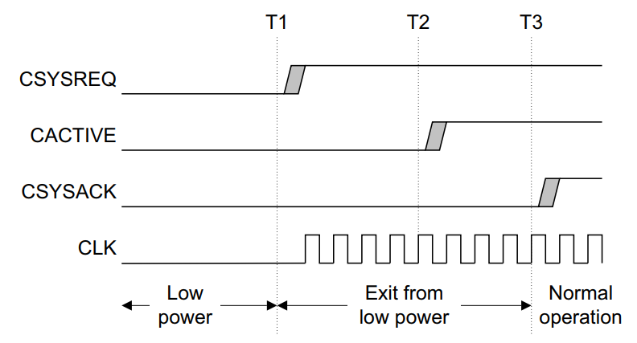

在T1时刻，系统时钟控制器拉高CSYSREQ信号以请求退出低功耗状态，然后使能时钟，外设识别到CSYSREQ信号为高电平后开始执行其自身的上电序列，并在T2时刻拉高CACTIVE信号表示它需要时钟信号，然后外设在T3时刻拉高CSYSACK完成退出序列。

外设触发退出序列：

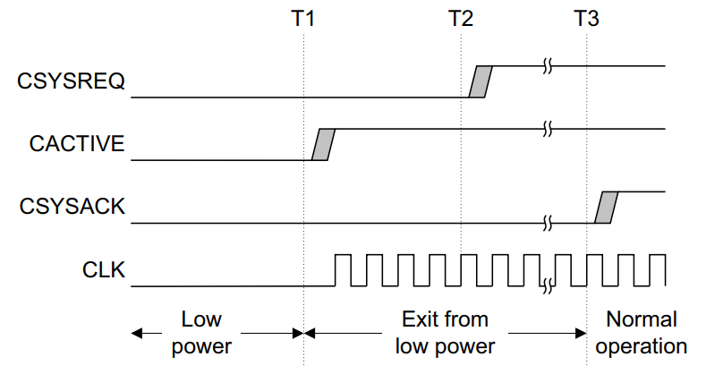

在T1时刻外设拉高CACTIVE信号以通知其需要时钟信号，然后系统时钟控制器必须恢复时钟。

在T2时刻系统时钟控制器拉高CSYSREQ信号以便继续握手序列，外设接下来会拉高CSYSACK信号以完成退出序列。

**注意：外设可以让CSYSACK保持数个周期的低电平以完成自身的退出序列。**

#### 组合低功耗域中的外设

系统时钟控制器可以组合一些不同的外设到一个相同的低功耗时钟域中，它可以将时钟域看作一个单独的外设，但要求下列规则必须遵守：

* 时钟域的CACTIVE信号是时钟域中所有外设CACTIVE信号的逻辑或，这意味着系统时钟控制器只有当所有外设都表示其时钟可以被关闭时才可以关闭时钟。
* 系统控制器必须使用单个CSYSREQ信号路由到时钟域中的全部外设。
* 时钟域CSYSACK信号通过下述方法生成：只有当时钟域中的最后一个外设拉低CSYSACK信号时才会拉低总的CSYSACK信号，只有当时钟域中的最后一个外设拉高CSYSACK信号时才会拉高总的CSYSACK信号。

## 默认信号和互操作性

AXI协议并不要求一个组件使用AXI接口的完整可用信号集。

### 互操作性原则

下列互操作性原则针对AXI3和AXI4组件。

作为一个一般性原则，组件必须支持全部的输入组合，但不必生成全部的输出组合，例如，从设备必须支持不同可能突发长度，但主设备可以只生成它所用的突发类型，这个策略保证全部的组件都能配合其它的组件工作。

AXI接口可以省略信号的条件如下：

* 可选输出：如果一个组件所需的值不与默认值匹配，组件就必须拥有其对应的输出信号，如果一个组件总是需要默认值，则不需要组件存在实际的信号。
* 可选输入：如果一个信号不需要被主设备或从设备观测也能让功能操作正确执行，则该输入信号是可以忽略的。

**注意：互联组件在合适的时候也可以忽略信号，例如，当一个信号仅输出默认值，则该信号就不需要被互联器转发，该信号可以直接在其目的端生成，类似地，如果一个信号不被任何目的端所使用，那么就不需要互联器转发该信号。**

### 主要接口类别

#### 读写接口

读写接口包含下列AXI通道：

* AR：读地址通道。
* R：读数据通道。
* AW：写地址通道。
* W：写数据通道。
* B：写响应通道。

#### 只读接口

只读接口仅支持读事务，因此只包含下述通道：

* AR：读地址通道。
* R：读数据通道。

**注意：只读接口不支持独占访问。**

#### 只写接口

只写接口仅支持写事务，因此只包含下述通道：

* AW：写地址通道。
* W：写数据通道。
* B：写响应通道。

**注意：只写接口不支持独占访问。**

#### 存储器从设备和外设从设备

AXI从设备分为存储器从设备与外设从设备。

存储器从设备必须正确地处理全部事务类型。

规范期望外设从设备拥有一个定义的访问方法，该方法建立了可以用于访问设备的事务类型以及对设备访问方式的限制。通常，定义的访问方法在组件的datasheet中描述，任何未定义的访问方法或许都会造成外设从设备失败，但规范期望以协议兼容的失败-安全方法完成访问以避免系统死锁，但不要求外设从设备继续进行正确的操作。

因为只有当使用外设定义的访问方法时才要求外设正常工作，因此外设从设备可以拥有接口信号的极小子集。

**注意：规范期望所有外设都支持C语言定义的访问方法，如8bit/16bit/32bit对齐访问事务。并不存在要求支持的最小子集，因为每个组件支持的事务子集都可以不同，例如，一个外设可能只支持16bit访问事务，但另一个外设只支持32bit访问事务。**

### 默认信号值

规范建议，一般而言，为了最大限度地重用IP，一个AXI组件接口包含所有的信号，这样就降低了设计流程中系统集成阶段出现错误的风险，它还可以帮助一些不能有效支持缺少信号的默认值的设计流程。

下列的几个表展示了AXI强制和可选信号，同时给出了可选信号的默认值。

主接口写通道信号和默认值：

|   信号   |     描述     | 方向  | 是否强制 |    默认值     |
| :------: | :----------: | :---: | :------: | :-----------: |
|   ACLK   |   公共时钟   | 输入  |   强制   |       -       |
| ARESETn  |   公共复位   | 输入  |   强制   |       -       |
|   AWID   |   写地址ID   | 输出  |   可选   |      全0      |
|  AWADDR  |    写地址    | 输出  |   强制   |       -       |
| AWREGION |    写区域    | 输出  |   可选   |      全0      |
|  AWLEN   |   突发长度   | 输出  |   可选   |  全0，长度1   |
|  AWSIZE  |   突发大小   | 输出  |   可选   | 数据总线宽度  |
| AWBURST  |   突发类型   | 输出  |   可选   | 01，递增模式  |
|  AWLOCK  |   锁定类型   | 输出  |   可选   | 全0，一般访问 |
| AWCACHE  |  Cache类型   | 输出  |   可选   |     0000      |
|  AWPROT  |   保护类型   | 输出  |   强制   |       -       |
|  AWQOS   |    QoS值     | 输出  |   可选   |     0000      |
| AWVALID  |  写地址有效  | 输出  |   强制   |       -       |
| AWREADY  | 写地址准备好 | 输入  |   强制   |       -       |
|  WDATA   |    写数据    | 输出  |   强制   |       -       |
|  WSTRB   |  写字节使能  | 输出  |   可选   |      全0      |
|  WLAST   |    写最后    | 输出  |   强制   |       -       |
|  WVALID  |    写有效    | 输出  |   强制   |       -       |
|  WREADY  |   写准备好   | 输入  |   强制   |       -       |
|   BID    |    响应ID    | 输入  |   可选   |       -       |
|  BRESP   |    写响应    | 输入  |   可选   |       -       |
|  BVALID  |  写响应有效  | 输入  |   强制   |       -       |
|  BREADY  |  响应准备好  | 输出  |   强制   |       -       |

存储器从接口写通道信号和默认值：

|   信号   |     描述     | 方向  | 是否强制 |  默认值  |
| :------: | :----------: | :---: | :------: | :------: |
|   ACLK   |   公共时钟   | 输入  |   强制   |    -     |
| ARESETn  |   公共复位   | 输入  |   强制   |    -     |
|   AWID   |   写地址ID   | 输入  |   强制   |    -     |
|  AWADDR  |    写地址    | 输入  |   强制   |    -     |
| AWREGION |    写区域    | 输入  |   可选   |    -     |
|  AWLEN   |   突发长度   | 输入  |   强制   |    -     |
|  AWSIZE  |   突发大小   | 输入  |   强制   |    -     |
| AWBURST  |   突发类型   | 输入  |   强制   |    -     |
|  AWLOCK  |   锁定类型   | 输入  |   可选   |    -     |
| AWCACHE  |  Cache类型   | 输入  |   可选   |    -     |
|  AWPROT  |   保护类型   | 输入  |   可选   |    -     |
|  AWQOS   |    QoS值     | 输入  |   可选   |    -     |
| AWVALID  |  写地址有效  | 输入  |   强制   |    -     |
| AWREADY  | 写地址准备好 | 输出  |   强制   |    -     |
|  WDATA   |    写数据    | 输入  |   强制   |    -     |
|  WSTRB   |  写字节使能  | 输入  |   强制   |    -     |
|  WLAST   |    写最后    | 输入  |   可选   |    -     |
|  WVALID  |  写有效输入  | 输入  |   强制   |    -     |
|  WREADY  |   写准备好   | 输出  |   强制   |    -     |
|   BID    |    响应ID    | 输出  |   强制   |    -     |
|  BRESP   |    写响应    | 输出  |   可选   | 00，OKAY |
|  BVALID  |  写响应有效  | 输出  |   强制   |    -     |
|  BREADY  |  响应准备好  | 输入  |   强制   |    -     |

主接口读通道信号和默认值：

|   信号   |     描述     | 方向  | 是否强制 |    默认值     |
| :------: | :----------: | :---: | :------: | :-----------: |
|   ARID   |   读地址ID   | 输出  |   可选   |      全0      |
|  ARADDR  |    读地址    | 输出  |   强制   |       -       |
| ARREGION |    读区域    | 输出  |   可选   |      0x0      |
|  ARLEN   |   突发长度   | 输出  |   可选   |  全0，长度1   |
|  ARSIZE  |   突发大小   | 输出  |   可选   | 数据总线宽度  |
| ARBURST  |   突发类型   | 输出  |   可选   | 01，递增模式  |
|  ARLOCK  |   锁定类型   | 输出  |   可选   | 全0，一般访问 |
| ARCACHE  |  Cache类型   | 输出  |   可选   |     0000      |
|  ARPROT  |   保护类型   | 输出  |   强制   |       -       |
|  ARQOS   |    QoS值     | 输出  |   可选   |     0000      |
| ARVALID  |  读地址有效  | 输出  |   强制   |       -       |
| ARREADY  | 读地址准备好 | 输入  |   强制   |       -       |
|   RID    |   读数据ID   | 输入  |   可选   |       -       |
|  RDATA   |    读数据    | 输入  |   强制   |       -       |
|  RRESP   |    读响应    | 输入  |   可选   |       -       |
|  RLAST   |    读最后    | 输入  |   可选   |       -       |
|  RVALID  |    读有效    | 输入  |   强制   |       -       |
|  RREADY  |   读准备好   | 输出  |   强制   |       -       |

存储器从接口读通道信号和默认值：

|   信号   |     描述     | 方向  | 是否强制 |  默认值  |
| :------: | :----------: | :---: | :------: | :------: |
|   ARID   |   读地址ID   | 输入  |   强制   |    -     |
|  ARADDR  |    读地址    | 输入  |   强制   |    -     |
| ARREGION |    读区域    | 输入  |   可选   |    -     |
|  ARLEN   |   突发长度   | 输入  |   强制   |    -     |
|  ARSIZE  |   突发大小   | 输入  |   强制   |    -     |
| ARBURST  |   突发类型   | 输入  |   强制   |    -     |
|  ARLOCK  |   锁定类型   | 输入  |   可选   |    -     |
| ARCACHE  |  Cache类型   | 输入  |   可选   |    -     |
|  ARPROT  |   保护类型   | 输入  |   可选   |    -     |
|  ARQOS   |    QoS值     | 输入  |   可选   |    -     |
| ARVALID  |  读地址有效  | 输入  |   强制   |    -     |
| ARREADY  | 读地址准备好 | 输出  |   强制   |    -     |
|   RID    |   读数据ID   | 输出  |   强制   |    -     |
|  RDATA   |    读数据    | 输出  |   强制   |    -     |
|  RRESP   |    读响应    | 输出  |   可选   | 00，OKAY |
|  RLAST   |    读最后    | 输出  |   强制   |    -     |
|  RVALID  |    读有效    | 输出  |   强制   |    -     |
|  RREADY  |   读准备好   | 输入  |   强制   |    -     |

#### 主设备地址

AxADDR：规范并没有规定该信号的最小长度，如果系统地址总线比主设备地址信号更宽，则额外的高地址位全部设为0，如果更窄，则多余的高地址位不能连接到系统地址总线。

**注意：一般情况下主设备支持32bit地址，主设备可选支持到至多64bit地址。**

#### 从设备地址

AxADDR：规范并没有规定该信号的最小长度，同时规范也不要求从设备对系统数据总线宽度内的数据使用低地址位进行寻址，并假设这些低地址位为全0，如果从设备的地址线比互联器更宽，则多余的高低地址位默认全0。

通常一个存储器从设备至少能够完全译码整个4KB地址空间。

#### 存储器从设备

AxLOCK：规范不要求存储器从设备使用AxLOCK输入信号，然而，支持独占访问事务的存储器从设备需要这些信号。

AxCACHE：规范不要求存储器从设备使用AxCACHE信号，如果一个存储器从设备不支持Cache行为或所有的事务以相同的方式Cache，则该设备不需要这个信号。

#### 写事务

WSTRB[3:0]：如果主设备总是执行整个数据总线宽度的写事务，则规范不要求主设备使用写字节使能信号，写字节使能的默认值是全1。

WLAST：规范不要求从设备使用WLAST信号，因为已定义写突发长度，从设备可以根据突发长度AWLEN[7:0]信号计算出最后一次写数据传输。

#### 读事务

RLAST：规范不要求主设备使用RLAST信号，因为已定义读突发长度，主设备可以根据突发长度ARLEN[7:0]信号计算出最后一次读数据传输。

#### 响应信号

RRESP，BRESP：如果主设备不需要执行独占访问事务也不需要事务错误通知，则主设备可以不使用RRESP与BRESP输入信号；如果从设备不需要支持独占访问事务也不需要生成错误响应，则从设备可以不使用RRESP与BRESP输出信号。

#### 不安全和安全访问

AxPROT：规范不要求从设备区分非安全和安全访问，也不要求任何额外的保护支持，因此不要求从设备支持AxPROT输入信号。

**注意：要特别注意AxPROT信号，AxPROT[1]信号表示事务是否为安全事务，不正确的设置可能会导致不正确的系统行为。**